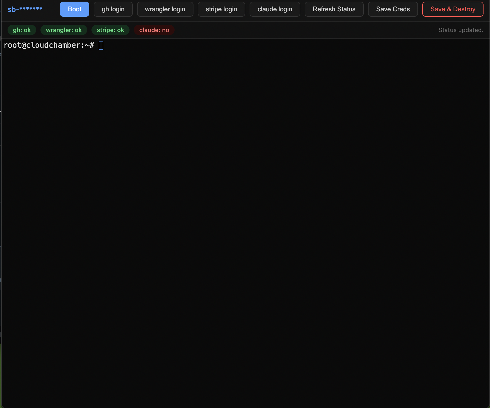

Experiment: Can I have a cloudflare sandbox where the user is logged in into their own `stripe`, `git`, `gh` and `wrangler`, then expose the terminal with all the commands as a tool with proper sleeping built-in when the tool isn't used? [prompt](https://contextarea.com/rules-httpsraw-kaspqgmf8agwz1?key=result)

Answer : YES!

What works

- stripe login
- wrangler login
- gh login

What doesn't work

- login into a coding agent using claude subscription (claude, pi)

TODO:

- remove claude logic entirely
- expose command line interface as tool to an "ai" agent
